# LDTK and Godot

## Installing Godot and creating a new project
Head to https://godotengine.org and download and install the latest version of
Godot.


Next we will want to create a new Godot project. Name it something memorable and
the folder somewhere you can easily find it later.


Once the project loads up, we can close it and will come back to it later once
we create our level.

## Installing LDTK and creating a new project
Head to https://ldtk.io and download and install the latest version of LDTK.


Open up LDTK and create a new project. Make sure you put it inside the folder
for the Godot project you made earlier.


## Getting assets
For this tutorial I will be using some Creative Commons assets but really you
could use any tileset you have available.


Head over to https://0x72.itch.io/dungeontileset-ii and download the assets.
Unzip them and grab 0x72_DungeonTilesetII_v1.7.png out of the uncompressed
folder and move it into your Godot project folder.

## Setting up LDTK level
Inside of the LDTK project, we will want to set the size of our level. Since our
tiles are 16 by 16 and I want a 20 by 12 map, I will set the width and height of
the level to 320 by 192 pixels. This is fairly arbitrary and you can set it to
whatever you want but this is as smallest as I can reasonably have the level at
in a 16:9 ratio for the sake of the tutorial.


## Importing our tileset
We need to import the tileset into our level. To do this click on the Tilesets
or simply use the keybind 'T'. A menu should pop up. Create a new tileset and
pick the 0x72_DungeonTilesetII_v1.7.png tileset as the Source Image. LDTK should
autodetect all the rest.


## Setting up Layers
In LDTK, layers are what you draw with. The level editor can use these layers
plus some rules we will talk about later to autogenerate tiles. Go to the Layers
menu or use the keybind 'L'. In the menu that pops up, make a new IntGrid layer,
call it "Collisions", set the Auto-layer Tileset to our tileset and in the Grid
Values section name it "Walls" and make it a dark red colour.

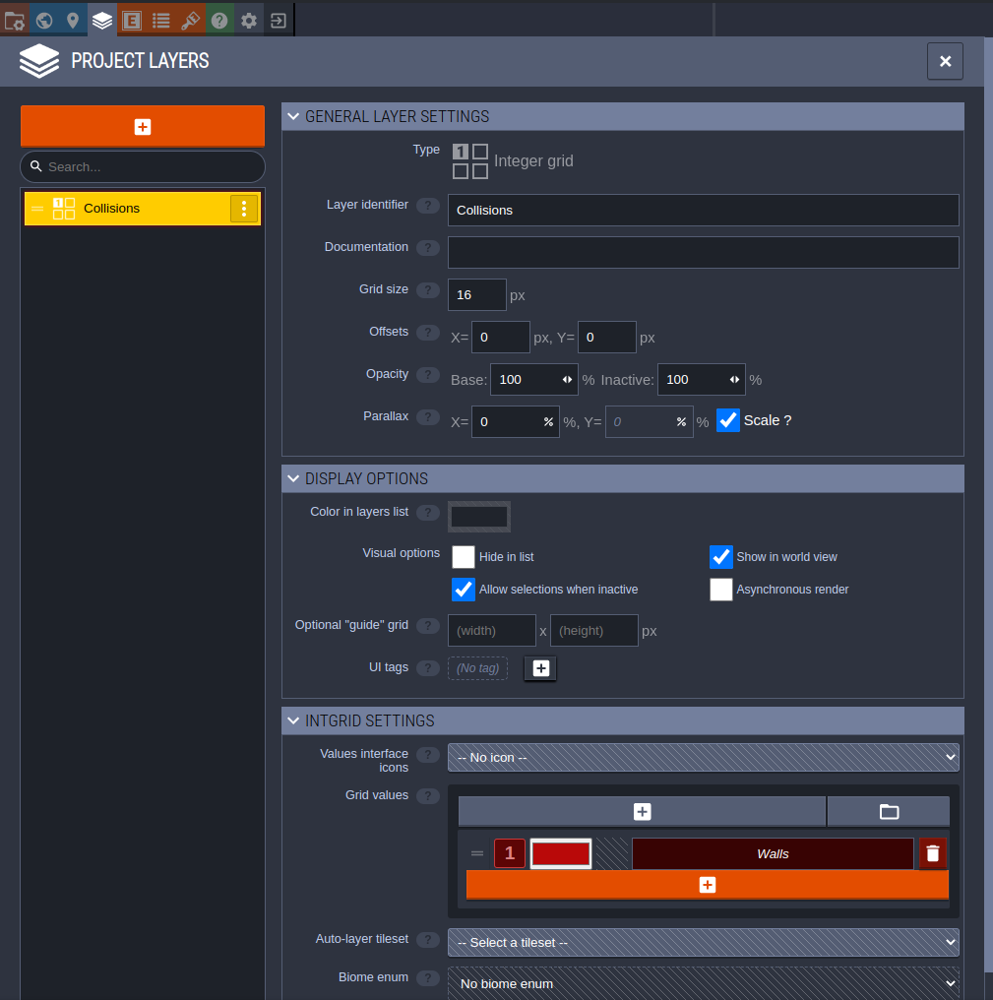

Now make a new Auto-layer layer and name it 'Floors'. Set the Auto-layer source
to 'Collisions' and the Auto-layer tileset to our tileset. Make sure to drag the
Floor layer so that it is below the Collisions layer in the sidebar. Now the
idea behind this layer is to setup this layer such that it fills in anything
that isn't a Collision. To do this hit 'Edit Rules'.

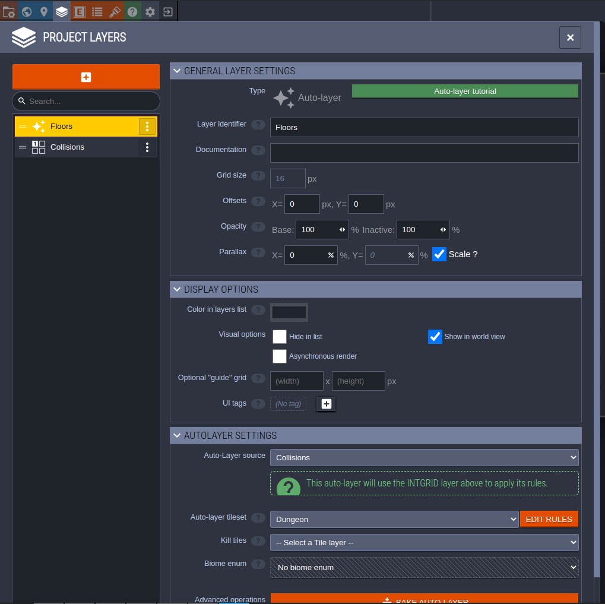

## Floor rules
Make a new empty group and call it 'Floors'. Hit the orange Plus icon to make a
new rule. Click on the top bar for Individual Tiles and select the regular floor
tile. Now right click on the center tile in the grid. What this does is it sets
up a rule that fills anything that isn't a wall with our floor tile.

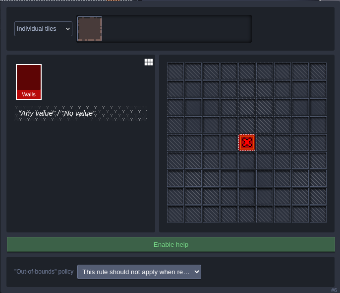

Make a new rule. When selecting the tiles, select all the broken tiles by
Control clicking on them. 

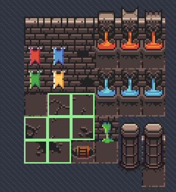

Right on the center tile like before. Once you escape out of the rule, it will
apply and set all the tiles to random broken tiles. But of course we do not want
all the tiles to be broken! To solve this we can change the probability that a
tile will be broken. Hit the dice icon and change the value from 100 to 40. Also
hit the P icon to enable perlin filtering. Now right click it and you can change
the scale, octaves and regenerate the filter if need be. The broken tile pattern
will now appear a lot more random.

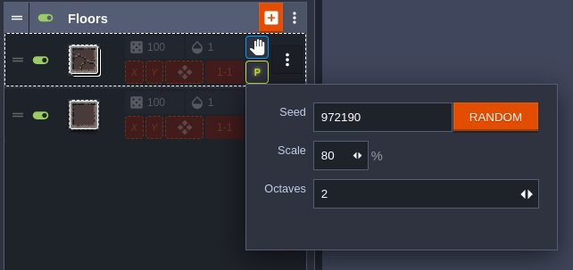

## Wall Rules
Now exit that menu and hit on the Rules button in the Collisions layer.

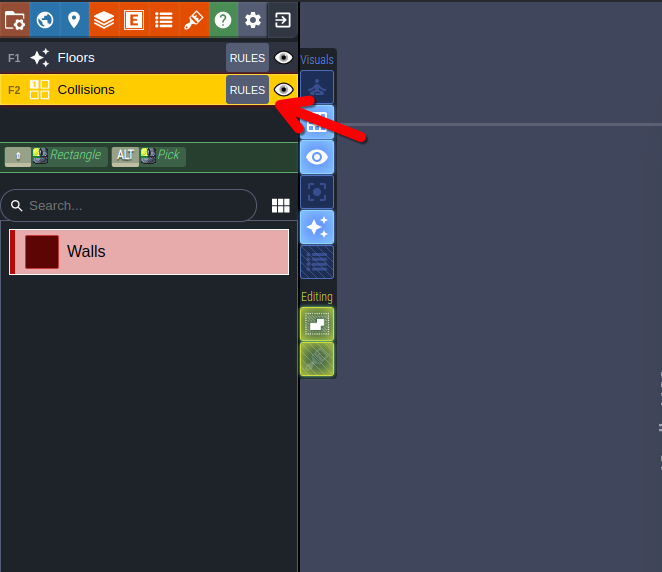

Make a new empty group and call it 'Walls'. Make a new rule and select the empty
tile in the top left and click on the center tile. You will now notice if you
try painting some walls, the floors will dissapear and you get an empty tile.

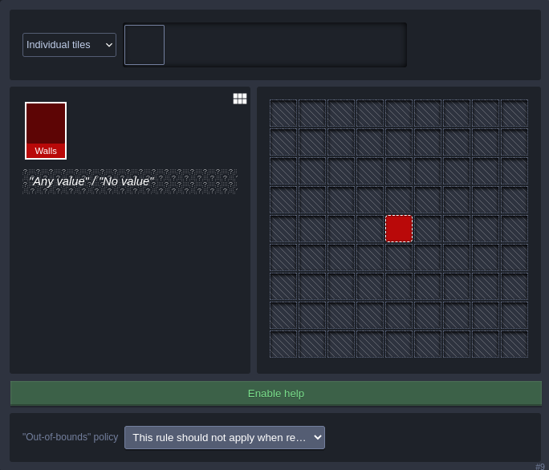

Make a new rule and select the second wall tile in the middle. Click on the
center tile and right click on the tile below it in the grid. This will make it
so that any Wall tile we paint with a floor below it will be filled in.

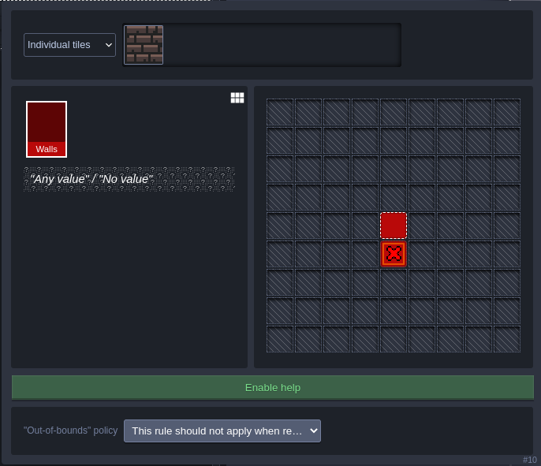

Lets add some wall decorations. Duplicate the rule we just made by right
clicking on it and selecting the 'x2' icon. Now change the selected tiles it
has to the wall decorations below. You can deselect the old undecorated wall
tile by right clicking. Reduce the probability of the decorations to 35.

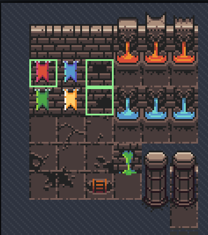

Duplicate the original wall rule, change it to 'Rectangle of tiles' and select
the top middle in the grid. When selecting tiles, hold down shift and select the
middle water fountain. Reduce the probability of this rule to 20. Turn on perlin
filtering as well. Duplicate the previous rule and select the slime fountain instead.

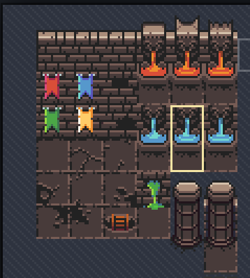
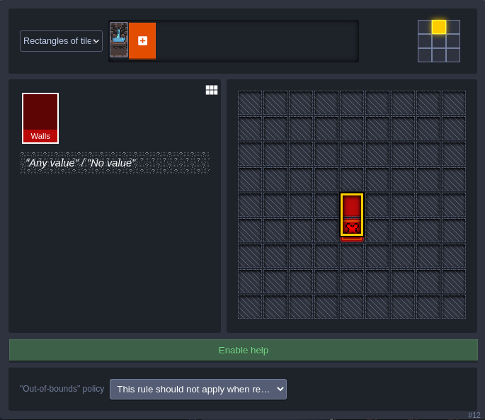

Lets make the top of the walls appear as well. Make a new rule, select the tile
above the wall. Click on the tile below the central tile in the grid and then
right click on the one below that.

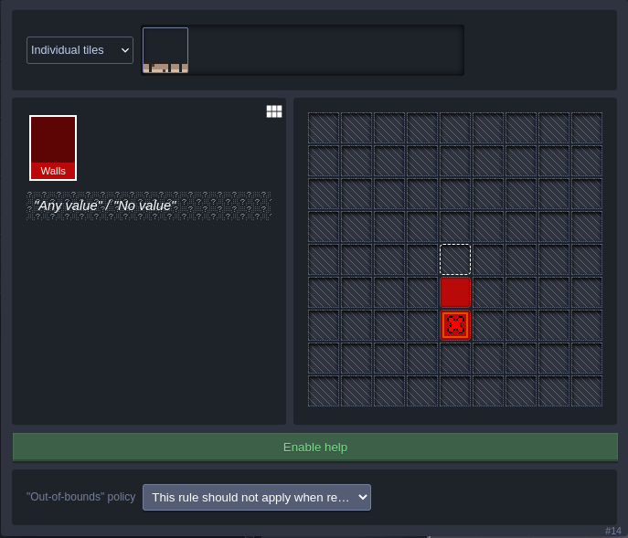

## Drawing your level
We are done with setting up the autorules! You can now draw the level as you
wish. The rules will automatically apply and fill in. Once you are finished
Ctrl-S to save your work.

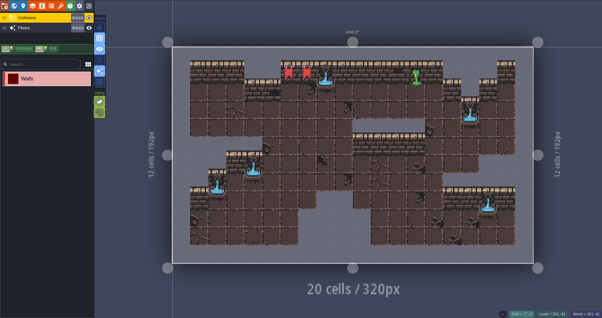

## LDTK importer plugin
Open up your project in Godot. Go to the AssetLib page and search for the LDTK
importer plugin. Once you download it, create an "addons" folder under "res://"
and move the "ldtk-importer" folder inside.

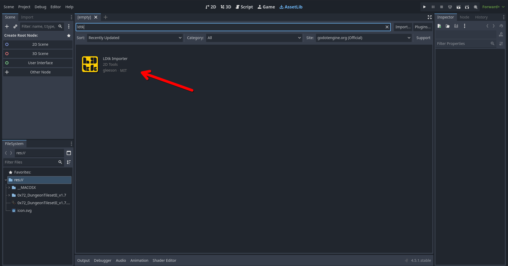

Now go to `Project > Project Settings > Plugins` and enable the plugin. Now reload
the project by going to `Project > Reload Current Project`.

## Importing level
Click on your .ldtk file and go to the Import tab. Import it. Now right click
the .ldtk file and click on `New Inherited Scene`. Ctrl-S to save the new scene.

Go to `Project > Project Settings`. Inside `General > Display > Window`, change
`Viewport Width` and `Viewport Height` to 1280 and 720 respectively. Set the
`Scale Factor` to 4.0 and the `Scale Mode` to `integer`. Under `Rendering >
Textures` set the `Default Texture Filter` to `Nearest`. Under `Rendering > 2D`,
turn `Snap 2D Transforms to Pixel` on. The reasoning behind this is to take our
320 px by 192 px level and scale it to fit the window. The other settings are to
stop the pixels from being blurred by Godot's default filters.

If you click on the play button now, your level should appear. If it prompts you
to select the Current Scene do so.

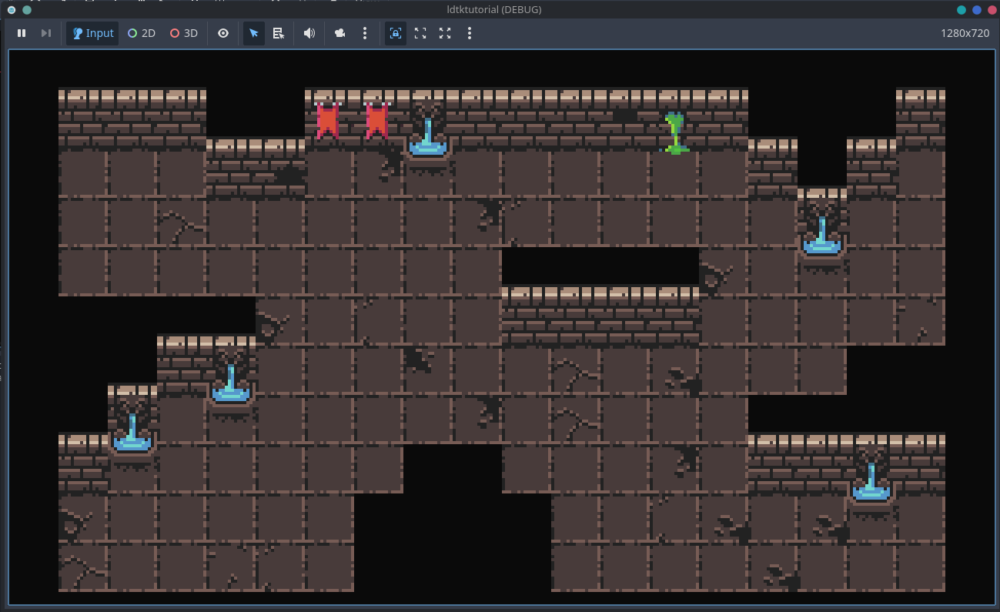

## Collisions
Inside of the `tilesets` folder, double click on `tileset_16px.res`. On the
right hand menu, under `Physics Layer`, hit `Add Element`. In the menu on the
bottom navigate to `Tileset` and select all the tiles we want to have collisons
for by holding shift. You will want to go to `Select > Physics > Physics Layer
0` and use the green Points tool to make a rectangle by clicking on the 4
corners. (You need to click on the first point you made at the end again)

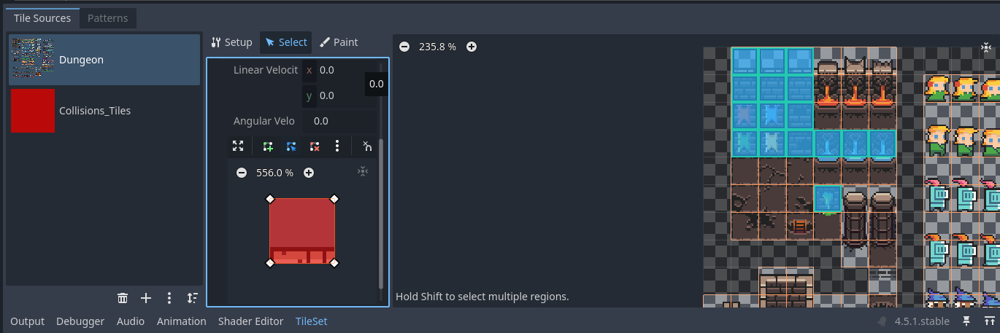

Go to `Debug` and turn on `Visible Collison Shapes`. If you run the game now you
will see the collisions shapes.
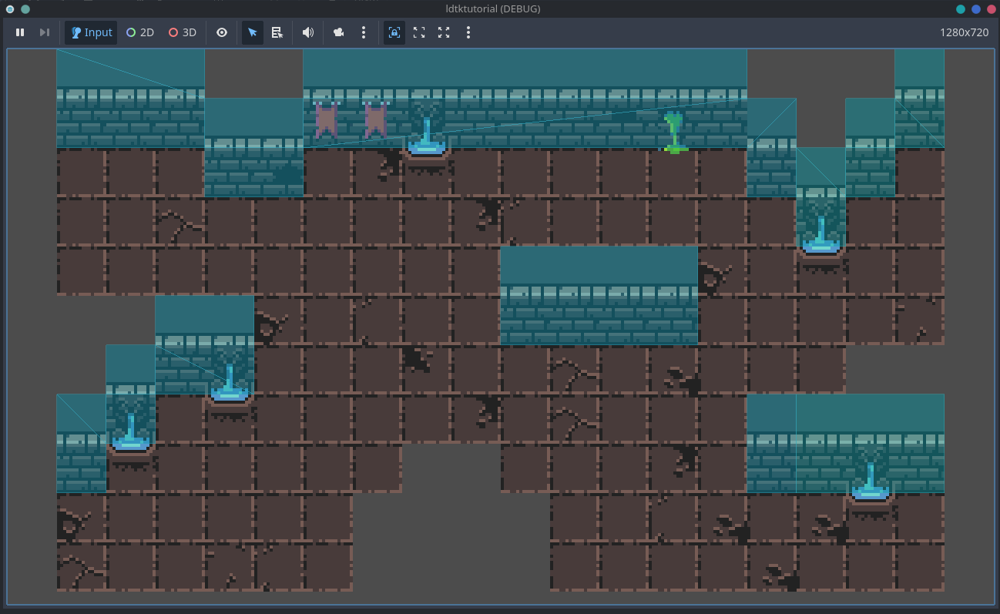


## Adding a Player Character
Inside of the folder you uncompressed for your tileset, there will be a folder
called `frames`. Move all the sprites starting with `knight_m` to a new folder
inside the Godot project called `Player`.

Right click on the `Level_O` in the sidebar and click on `Add Child Node`. Add a
`CharacterBody2D` node. Now under that node add a `AnimatedSprite2D` node and
`CollisionShapes2D` node.

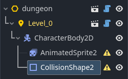

Rename the `CharacterBody2D` to `Player`. Right click on it and do `Save Branch
as Scene` and save it under the `Player` folder. Click on the `Open in Editor`
icon next to the Player in the sidebar. Click on the `AnimatedSprite2D` on the
right hand menu, set `Transform > Position > y` to -11. Set the `Sprite Frames`
property to `New Sprite Frame`. Click on it.

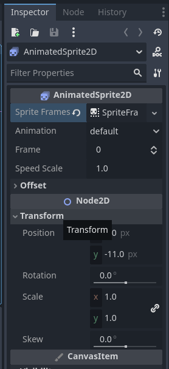

Shift select all the `knight_idle_m` frames. Drag and drop them in the Sprite
Frames menu at the bottom of the screen. Set the FPS to 10. Rename the animation
from `default` to `Idle`.

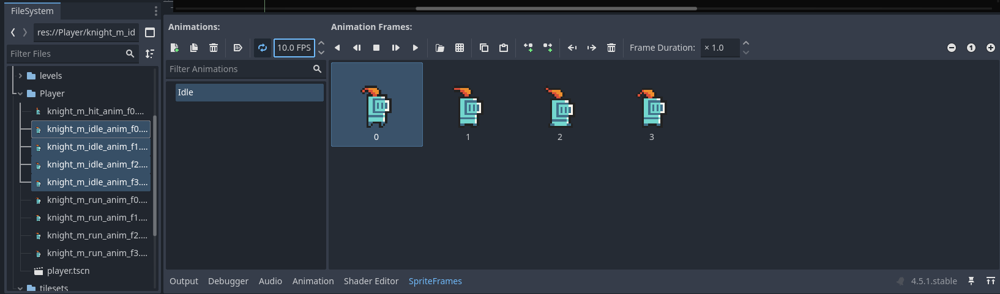

Use Ctrl-N to create a new Animation. Name it `Run`. Shift select all the
`knight_run_m` frames. Drag and drop in the Sprite Frames menu at the bottom of
the screen. Set the FPS to 10.

Click on `CollisionShapes2D` and change the `Shapes` property to
`CapsuleShape2D`. Reshape the capsule to look something like below. Ctrl-S to
save the Player.
Hint: You can rotate in the `Transform` menu on the right.

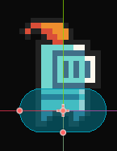

## Programming Player logic
Right click on the Player and click `Attach Script`. You can use the script
below and the game should have a playable character.

```gdscript
extends CharacterBody2D

@onready var sprite: AnimatedSprite2D = get_node("AnimatedSprite2D")

const speed = 80
const acceleration = 10

func get_input_direction() -> Vector2:
	# Gets key input as vector
	var direction: Vector2 = Input.get_vector("ui_left", "ui_right", "ui_up", "ui_down")
	
	# Flip the sprite if either left or right has been pressed
	if direction.x < 0:
		sprite.flip_h = true
	if direction.x > 0:
		sprite.flip_h = false
		
	return direction

# Runs every frame
func _process(delta: float) -> void:
	# Normalize vector to ensure to diagonal speedboost
	var input_dir = get_input_direction().normalized()
	
	# Play Idle animation if not moving otherwise play Run
	if input_dir == Vector2.ZERO:
		sprite.play("Idle")
	else:
		sprite.play("Run")
		
	# Gradually approach desired velocity rather than immediately
	# to have movement appear more natural
	velocity = Vector2(
		lerp(velocity.x, input_dir.x * speed, acceleration * delta),
		lerp(velocity.y, input_dir.y * speed, acceleration * delta)
	)
	
	# Apply velocity to position and handle collision physics
	move_and_slide()
```
