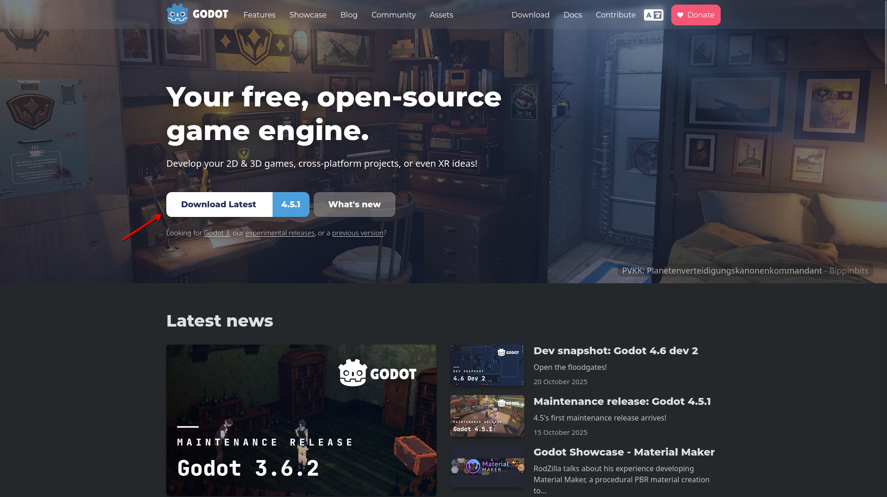
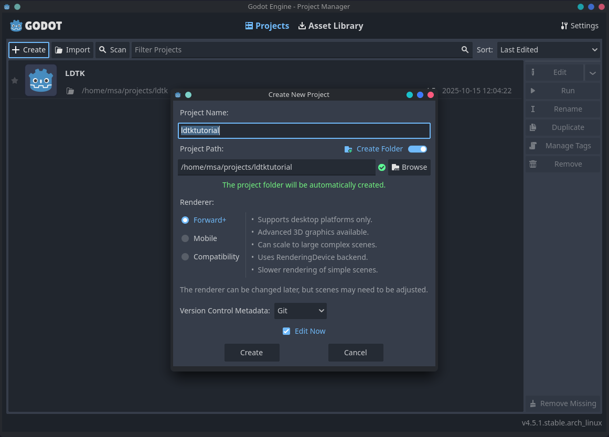
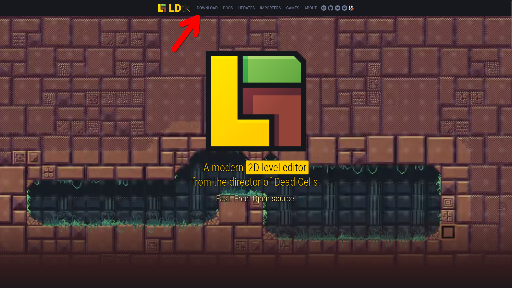
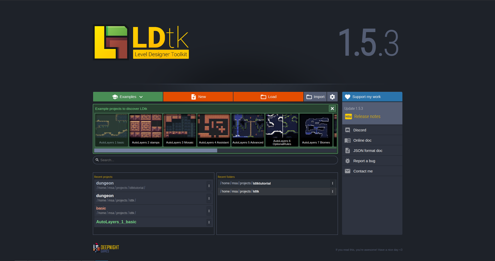
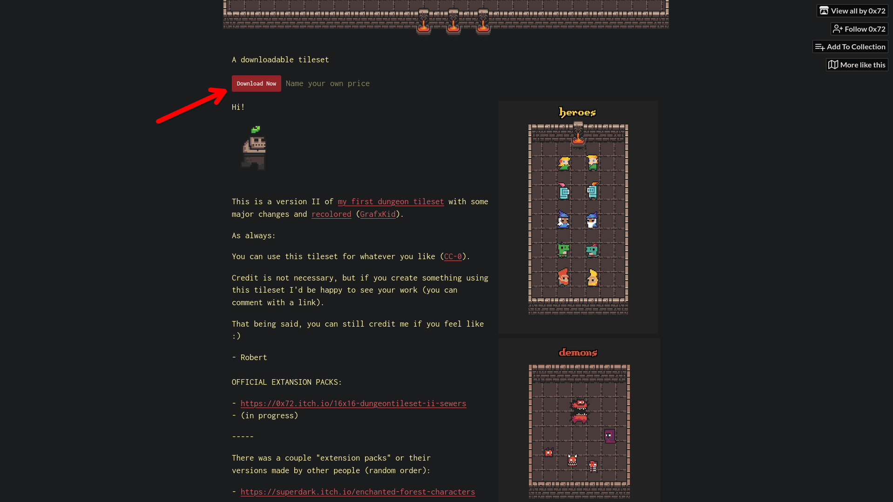
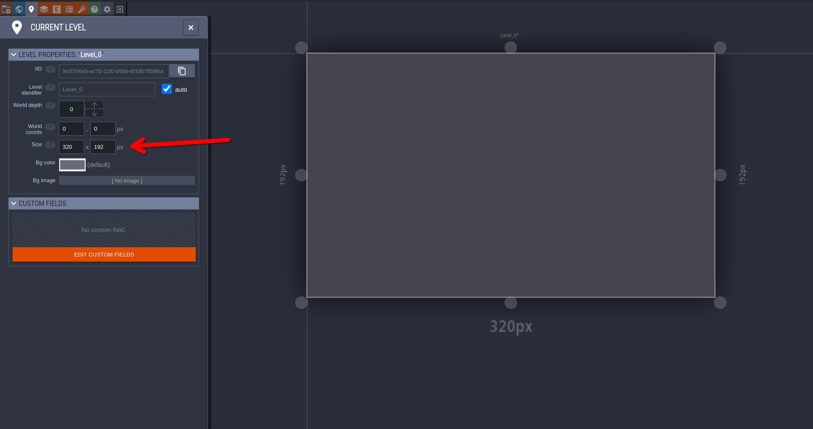
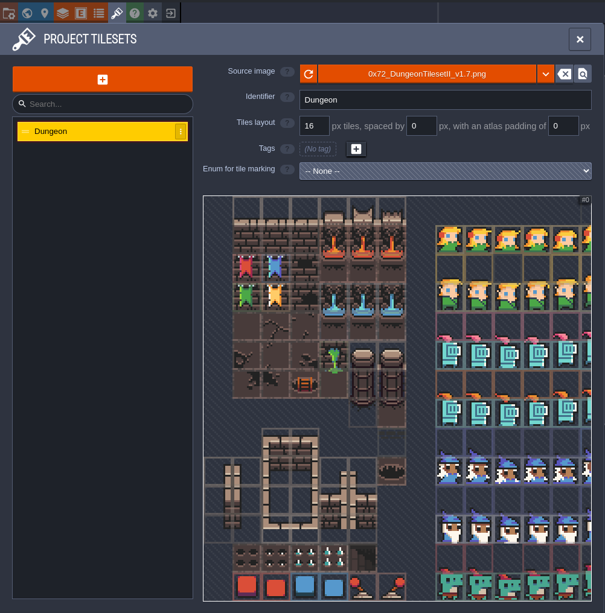

# LDTK and Godot

## Installing Godot and creating a new project
Head to https://godotengine.org and download and install the latest version of
Godot.

Next we will want to create a new Godot project. Name it something memorable and
the folder somewhere you can easily find it later.

Once the project loads up, we can close it and will come back to it later once
we create our level.

## Installing LDTK and creating a new project
Head to https://ldtk.io and download and install the latest version of LDTK.

Open up LDTK and create a new project. Make sure you put it inside the folder
for the Godot project you made earlier.

## Getting assets
For this tutorial I will be using some Creative Commons assets but really you
could use any tileset you have available.

Head over to https://0x72.itch.io/dungeontileset-ii and download the assets.
Unzip them and grab 0x72_DungeonTilesetII_v1.7.png out of the uncompressed
folder and move it into your Godot project folder.

## Setting up LDTK level
Inside of the LDTK project, we will want to set the size of our level. Since our
tiles are 16 by 16 and I want a 20 by 12 map, I will set the width and height of
the level to 320 by 192 pixels. This is fairly arbitrary and you can set it to
whatever you want but this is as smallest as I can reasonably have the level at
in a 16:9 ratio for the sake of the tutorial.

## Importing our tileset
We need to import the tileset into our level. To do this click on the Tilesets
or simply use the keybind 'T'. A menu should pop up. Create a new tileset and
pick the 0x72_DungeonTilesetII_v1.7.png tileset as the Source Image.

